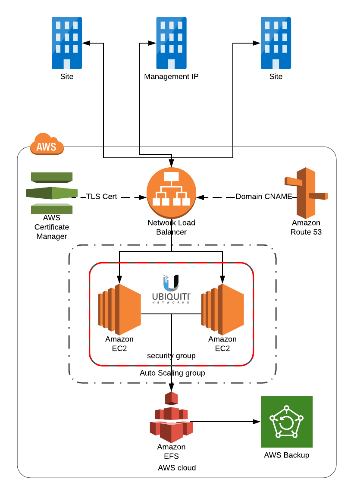

# Example: Ubiquiti Unifi Controller on AWS
This is a set of Cloudformation templates to deploy a Ubiquiti Unifi Controller on AWS. The key components are:
  - Network Load Balancer
  - EC2 instances running Ubuntu 16.04
  - Elastic Filesystem for shared Unifi data
  - AWS Backup for daily EFS backups

## Setup
  1. Set parameters in `config/unifi-${your region}.json` to suit
  2. Deploy `pipeline.yml` via Cloudformation
  3. Log into your chosen domain for the controller

## Architecture

